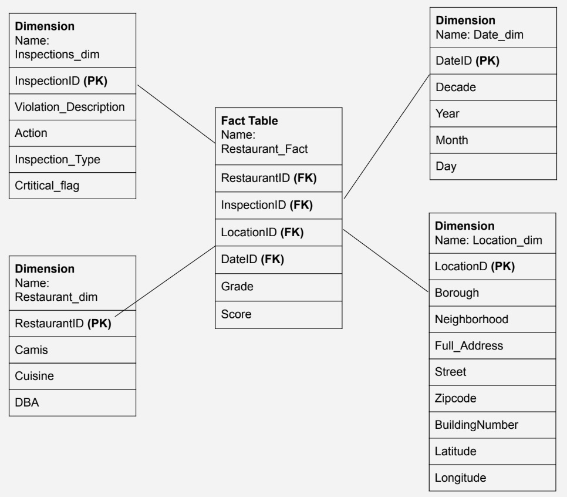
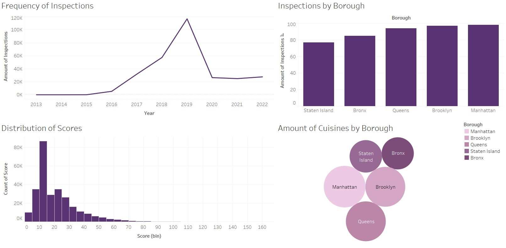
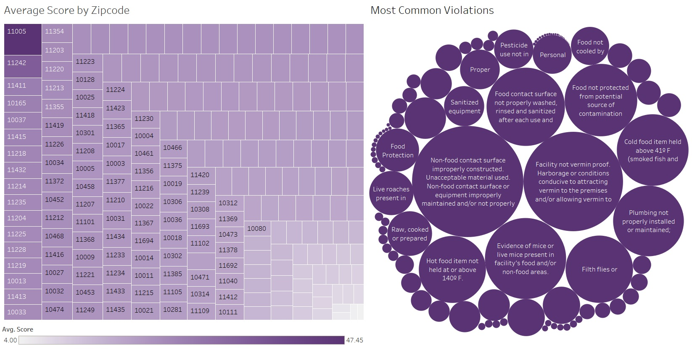

# NYC Restaurant Health
- Group #5: Alisa Leskova
- date completed: 5/11/2022
- class: CIS 9440

Project Objective: Follow the Kimball Lifecycle to design and develop a public,
cloud-based Data Warehouse with a functioning BI Applications that depicts a
clear view of restaurant health in NYC.

Project Tools:
The tools used to build this Data Warehouse were:
1. For data integration - Python code with Jupyter Notebooks
2. For data warehousing - Google BigQuery
3. For Business Intelligence - Tableau

## Kimball Lifecycle Project Stages

### Project Planning

Motivation for project:

  The goal of this project is to clearly demonstrate the overall health of
restaurants in NYC.

Description of the issues or opportunities the project will address:

  This project will address the opportunities to locate optimal locations for
various cuisines, determine which locations have favorable varieties
and scores. It will also track any suboptimal locations
and show trends in restaurant inspections.

Project Business or Organization Value:
  By demonstrating the health of restaurants across New York City, users can
gain insights about where to dine as a customer, or where to operate as a
prospective owner. Anyone interested in food inspection can use
the insights generated to narrow their focus and implement better regulations.
Owners can also compare their establishments to the averages across the city.

Data Sources:
1. DOHMH New York City Restaurant Inspection Results Dataset
https://data.cityofnewyork.us/Health/DOHMH-New-York-City-Restaurant-Inspection-Results/43nn-pn8j

### Business Requirements Definition

List of Data Warehouse KPI's:
1. Number of Inspections by Year
2. Distribution of Inspection Scores
3. Number of Inspections by Borough
4. Count of Cuisines by Borough
5. Average Score by Zip Code
6. Most Frequent Violations
7. Number of Restaurants by Zip Code
8. Number of Inspections by Cuisine

### Dimensional Model

This project's Dimensional Model consists of 1 Facts and 4 Dimensions

Use correct file path here to show picture of dimensional model...

This project's Kimball Bus Matrix:

Use correct file path here to show picture of dimensional model...

### Business Intelligence Design and Development

List of Visualizations for each KPI:
1. A line graph is used to demonstrate the Number of Inspections by Year
2. A histogram is used to depict the Distribution of Inspection Scores
3. A bar chart is used to show the Number of Inspections by Borough
4. A bubble graph is used to show the Count of Cuisines by Borough
5. A heat map is used to display the Average Score by Zip Code
6. A bubble chart is used to illustrate the Most Frequent Violations
7. A bubble chart shows the Number of Restaurants by Zip Code
8. A heat map is used to present the Number of Inspections by Cuisine

BI Application Wireframe design:

Use correct file path here to show picture of Wireframe design...

Pictures of final Dashboards:

Use correct file path here to show picture of Dashboard...

### Deployment

The project was deployed on Tableau Public: https://public.tableau.com/views/CIS9440NYCRestaurantHealthVisualizations/RestaurantHealthVariations_1?:language=en-US&:display_count=n&:origin=viz_share_link
